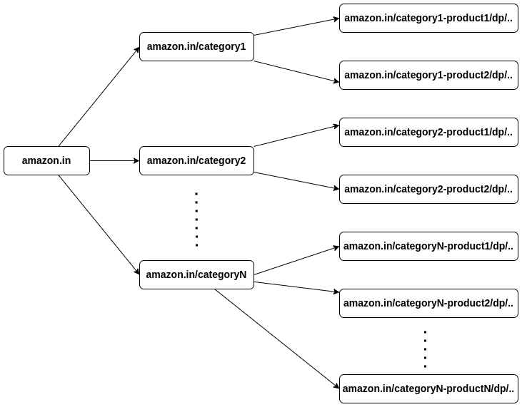

# Crawler for Discovering Product URLs on E-commerce Websites

## What is a web crwaler?
A web crawler is known as a spiderbot. It is widely used by search engines to discover new or updated content on the web. Content can be a web page, an image, a video, a PDF file, etc. A web crawler starts by collecting a few web pages and then follows links on those pages to collect new content.

## Our Objective:
Design and implement a web crawler whose primary task is to discover and list all product URLs across multiple e-commerce websites. You will be provided with a list of domains belonging to various e-commerce platforms. The output should be a comprehensive list of product URLs found on each of the given websites.

## Requirements:

### Input:
A list of domains that belong to different e-commerce websites.
Example: ["example1.com", "example2.com", example3.com"…]
The crawler should be able to handle a minimum of 10 domains and scale to handle potentially hundreds.

### Key Features:
- URL Discovery: The crawler should intelligently discover product pages, considering different URL patterns that might be used by different websites (e.g., /product/, /item/, /p/).
- Scalability: The solution should be able to handle large websites with deep hierarchies and a large number of products efficiently.
- Performance: The crawler should be able to execute in parallel or asynchronously to minimize runtime, especially for large sites.
- Robustness: Handle edge cases such as:
    - Websites with infinite scrolling or dynamically loaded content.
    - Variations in URL structures across different e-commerce platforms.

## High level design
          

### Seed URL
The crawler uses seed URLs as a starting point for the crawl process. To crawl all web pages from an e-commerce website, an intuitive way to select seed URLs is to use the e-commerce domain name. Example: ["www.flipkart.com", "www.amazon.in", "www.myntra.com", etc.]

### URL Frontier
Most modern web crawlers split the crawl state into two: to be downloaded and already downloaded. The component that stores URLs to be downloaded is called the URL Frontier. You can refer to this as a First-in-First-out (FIFO) queue. For detailed information about the URL Frontier, refer to the deep dive.

### HTML Downloader
The HTML downloader downloads web pages from the internet. Those URLs are provided by the URL Frontier.

### DNS Resolver
To download a web page, a URL must be translated into an IP address. The HTML Downloader calls the DNS Resolver to get the corresponding IP address for the URL. For instance, URL www.flipkart.com is converted to IP address 163.53.76.86 as of 25/12/2024.

### Content Parser
After a web page is downloaded, it must be parsed and validated because malformed web pages could provoke problems and waste storage space. Implementing a content parser in a crawl server will slow down the crawling process. Thus, the content parser is a separate component.

### Product Identifier (Is a Product Page?)
While crawling web pages of an e-commerce website, a web page may be a "product" page with similar or related products listed below as cards or it may be a "non-product" page with whole page containing list of product cards. Product Identifier identifies the "product" page urls and store it to Product URL Storage.

### Product URL Storage
It is a storage system for storing product page urls.

### Link Extractor
Link Extractor parses and extracts links from HTML pages by identifying "href" attributes and extracting its values using "RegEx". Relative paths are converted to absolute URLs by adding the domain name as prefix.

### URL Filter
The URL filter excludes certain content types, file extensions, error links and URLs to other sites.

### URL Seen?
“URL Seen?” is a data structure that keeps track of URLs that are visited before or already in the Frontier. “URL Seen?” helps to avoid adding the same URL multiple times as this can increase server load and cause potential infinite loops.

### URL Storage
URL Storage stores already visited URLs.

## Design deep dive
Up until now, we have discussed the high-level design. Next, we will discuss the most important building components and techniques in depth:
- Depth-first search (DFS) vs Breadth-first search (BFS)
- URL frontier

### DFS vs BFS
You can think of the web as a directed graph where web pages serve as nodes and hyperlinks (URLs) as edges. The crawl process can be seen as traversing a directed graph from one web page to others. Two common graph traversal algorithms are DFS and BFS. However, DFS is usually not a good choice because the depth of DFS can be very deep.

BFS is commonly used by web crawlers and is implemented by a first-in-first-out (FIFO) queue. In a FIFO queue, URLs are dequeued in the order they are enqueued. However, this implementation has following problem:
- Most links from the same web page are linked back to the same host. In Figure below, all the links in amazon.in are internal links, making the crawler busy processing URLs from the same host (amazon.in). When the crawler tries to download web pages in parallel, amazon servers will be flooded with requests. This is considered as “impolite”.

### URL frontier
URL frontier helps to address these problems. A URL frontier is a data structure that stores URLs to be downloaded. The URL frontier is an important component to ensure politeness.

Generally, a web crawler should avoid sending too many requests to the same hosting server within a short period. Sending too many requests is considered as “impolite” or even treated as denial-of-service (DOS) attack. For example, without any constraint, the crawler can send thousands of requests every second to the same website. This can overwhelm the web servers.

The general idea of enforcing politeness is to download one page at a time from the same host. A delay can be added between two download tasks. The politeness constraint is implemented by maintain a mapping from website hostnames to download (worker) threads. Each downloader thread has a separate FIFO queue and only downloads URLs obtained from that queue. Figure below shows the design that manages politeness.

- Queue router: It ensures that each queue (b1, b2, … bn) only contains URLs from the same host.
- Mapping table: It maps each host to a queue.

- FIFO queues b1, b2 to bn: Each queue contains URLs from the same host.
- Queue selector: Each worker thread is mapped to a FIFO queue, and it only downloads URLs from that queue. The queue selection logic is done by the Queue selector.
- Worker thread 1 to N. A worker thread downloads web pages one by one from the same host. A delay can be added between two download tasks.

